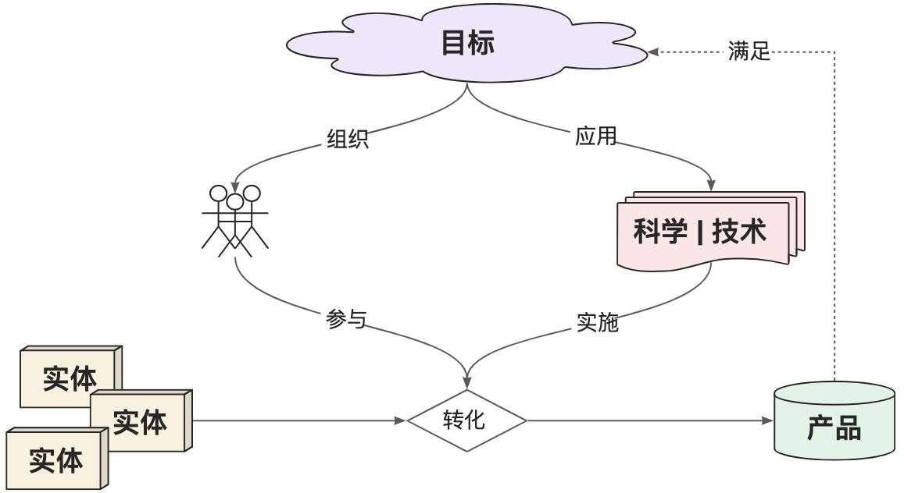
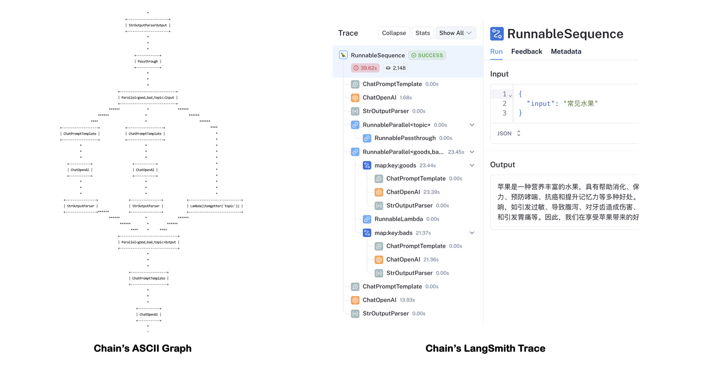

# 从API到Agent：万字长文洞悉LangChain工程化设计

我想做一个尝试，看看能不能用尽量清晰的逻辑，给“AI外行人士”（当然，我也是……）引入一下LangChain，试着从工程角度去理解LangChain的设计和使用。同时大家也可以将此文档作为LangChain的“10分钟快速上手”手册，本意是希望帮助需要的同学实现AI工程的Bootstrap。

> 文中所有的示例代码都已托管到GitHub：https://github.com/TuGraph-contrib/langchain-demo
>
> 喜欢实操的小伙伴可以边阅读，边复现。

# 1. 引言

## 1.1 什么是LangChain？

正式开始前，还是有必要从定义（**What**）开始。LangChain是2022年10月底，由哈佛大学的Harrison Chase发起的基于开源大语言模型的AI工程开发框架。当然也可以问一下AI：

> 我：LangChain是什么？
> GPT-4：LangChain 是一个开源的语言模型工具链框架，旨在使研究人员和开发人员能够更轻松地构建、实验和部署以自然语言处理（NLP）为中心的应用程序。它提供了多种组件和工具，可帮助用户利用最近的语言模型进展，如大型 Transformer 模型等，并且可以与 Hugging Face 等平台集成。
> LangChain 的核心理念是将语言模型用作协作工具，通过它，开发者可以构建出处理复杂任务的系统，并且可以高效地对接不同的数据源和应用程序接口（APIs）。这个框架试图简化连接不同的输入和输出流，以及在流中实现语言模型的过程。

顾名思义，LangChain中的“Lang”自然是指大语言模型，“Chain”即“链”，也就是将大模型与其他组件连接成链，借此构建AI工程应用。那么LangChain该如何（**How**）做到这一点的呢？解答这个问题之前，需要先回答什么是工程？什么是AI工程？

## 1.2 什么是AI工程？

我们先Review一下“工程”的百科定义：

> 工程是指以某组设想的**目标**为依据，应用有关的**科学**知识和**技术**手段，通过有组织的一群**人**将某个（或某些）现有**实体**（自然的或人造的）转化为具有预期使用价值的人造**产品**过程。

其中，“目标”定义了要解决的问题域，决定了工程的顶层设计和能力边界，同时也定义了“产品”的最终形态。提升“人”的ROI是工程设计的价值归属。“实体”是工程的生产材料输入，“科学 | 技术”是工程有序运行的基础，对它们的合理利用可以提升工程的整体产出效率。



于是，我们可以这样解读“AI工程”中的关键概念：

- **目标**：待解决的特定AI用户需求。如内容创作、智能问答、文档摘要、图像识别等等。
- **人**：实施AI工程的具体角色。可以是程序员，或者AI应用的研发团队、创业公司。
- **科学 | 技术**：显然是大模型与相关工具服务，以及其后的计算科学理论。
- **实体**：已有的文档、知识库、业务数据等生产材料。
- **产品**：能满足目标需求的具体产品。如聊天机器人、内容生成工具等。

## 1.3 如何设计LangChain？

因此，如果我们是LangChain的设计者，希望构建通用的AI工程框架。需要回答如下问题：

1. **【目标 | 产品】**LangChain的设计目标是什么，能解决哪些AI工程问题？
2. **【人】**LangChain的编程接口如何定义，才能提升AI工程师的研发效率？
3. **【实体 | 科学 | 技术】**LangChain的核心组件如何抽象，以提升框架的扩展能力？

当然，作为“事后诸葛”，这些问题目前有比较明确的答案：

1. 作为AI工程框架，LangChain实际是对LLM能力的扩展和补充。如果把LLM比作人的大脑，LangChain则是人的躯干和四肢，协助LLM完成“思考”之外的“脏活累活”。它的能力边界只取决于LLM的智力水平和LangChain能提供的工具集的丰富程度。
2. LangChain提供了LCEL（LangChain Expression Language）声明式编程语言，降低AI工程师的研发成本。
3. LangChain提供了Models、Prompts、Indexes、Memory、Chains、Agents六大核心抽象，用于构建复杂的AI应用，同时保持了良好的扩展能力。

很明显，LLM作为LangChain能力的基础，是了解LangChain工程化设计的前提。接下来我们就从最基础的LLM API使用谈起，一步步了解LangChain的工程化构建过程及其背后的设计理念。

# 2. 环境准备

- Python环境：建议3.8版本以上。
  - 下载链接：[https://www.python.org/downloads](https://www.python.org/downloads/)
- OpenAI SK：自备。
  - 申请地址：https://platform.openai.com/api-keys
  - 环境变量：`export OPENAI_API_KEY="<Your-OpenAI-SK>"`
- 安装LangChain：
  - 执行命令：`pip install langchain langchain-openai`

# 3. 设计推演

架构设计领域有个比较流行的术语——乐高架构，当然也可以叫可插拔架构。说白就是通过对系统基本组件的合理抽象，找到构造复杂系统的统一规律和可达路径，从而实现在降低系统实现复杂度的同时，提升系统整体的扩展性。（非官方表达，大家能Get到我的意思就好……）

LangChain实际上也遵循了乐高架构的思想。当然，作为最关键的乐高组件之一，LLM的能力自然是我们优先了解的对象，那我们就从OpenAI的API开始吧！

## 3.1 造梦基础——API

文本生成模型服务是OpenAI提供的最核心的API服务，自ChatGPT发布后经历过几次版本迭代。

### 3.1.1 Chat Completion API

当下最新的是[Chat Completion API](https://platform.openai.com/docs/api-reference/chat)，是AI与LLM交互的核心入口。

代码示例参考：

```python
import os
import requests

# API Key
api_key = os.getenv('OPENAI_API_KEY')

# 头部信息
headers = {
    'Content-Type': 'application/json',
    'Authorization': f'Bearer {api_key}'
}

# 准备数据
data = {
    'model': 'gpt-4',
    'messages': [{'role': 'user', 'content': '什么是图计算？'}],
    'temperature': 0.7
}

# 调用API
url = 'https://api.openai.com/v1/chat/completions'
response = requests.post(url, json=data, headers=headers)
answer = response.json()['choices'][0]['message']['content']
print(answer)
```

代码示例输出：

> 图计算是一种计算模型，用于处理大规模图形结构的数据，并执行各种复杂的算法和计算。这种计算模型主要用于社交网络分析、Web搜索、生物信息学、网络路由优化、数据挖掘等领域。图计算模型的核心是将数据表示为图形结构（节点和边），这样可以更好地揭示数据之间的关系和互动。在图计算中，算法通常以迭代的方式运行，每次迭代都会更新图中节点的状态，直到达到某种停止条件。

### 3.1.2 Completion API

早先的[Completion API](https://platform.openai.com/docs/api-reference/completions)已经在2023年7月后不再维护，和最新的Chat Completion API参数和结果格式有所不同，最明显的是Prompt是以纯文本方式传递，而非Message格式。

```python
# 准备数据
data = {
    'model': 'gpt-3.5-turbo-instruct',
    'prompt': ['什么是图计算？'],
    'max_tokens': 1024
}

# 调用API
url = 'https://api.openai.com/v1/completions'
response = requests.post(url, json=data, headers=headers)
answer = response.json()['choices'][0]['text']
print(answer)
```

除了文本生成服务，OpenAI也提供了大量的LLM的周边服务，以协助AI工程构建更复杂的应用能力。如：函数调用、嵌入、微调、多模态等，具体可参考[OpenAI开发文档](https://platform.openai.com/docs)的内容。

## 3.2 智能开端——Chat

自2022年11月底ChatGPT发布以来，AI的大门才真正地向人类打开，其中给用户留下最深印象的功能，自然是智能对话。OpenAI的Chat Completion API参数支持传入消息历史，可以轻松地实现简单的对话服务。

代码示例参考：

```python
# 对话历史
messages = []

def chat_with_ai(message):
    # 记录历史
    messages.append({'role': 'user', 'content': message})
    print(f'me: {message}')

    # 对话请求
    data = {
        'model': 'gpt-4',
        'messages': messages,
        'temperature': 0.7
    }
    url = 'https://api.openai.com/v1/chat/completions'
    response = requests.post(url, json=data, headers=headers)

    # 解析回答
    if response.status_code == 200:
        answer = response.json()['choices'][0]['message']['content']
        messages.append({'role': 'assistant', 'content': answer})
        print(f"ai: {answer}")
    else:
        print(f'Error: {response.status_code}', response.json())

# 多轮对话
chat_with_ai('什么是图计算？')
chat_with_ai('刚才我问了什么问题？')
```

代码示例输出：

> me: 什么是图计算？
> ai: 图计算是一种计算模型，用于处理大规模图形结构数据的计算和分析。在这种计算模型中，数据被表示为图形，其中节点代表实体，边代表实体之间的关系。图计算可以用于解决许多实际问题，如社交网络分析、网络路由、生物信息学等。图计算的主要挑战是如何有效地处理大规模的图形数据，并提供快速的计算和分析结果。
> me: 刚才我问了什么问题？
> ai: 你问的问题是：“什么是图计算？”

## 3.3 初步封装——SDK

到目前为止，我们还只是用OpenAI最原始的RESTful API构建LLM工程能力，甚至连OpenAI提供的SDK都未使用。显然这不是一个高效的方式，使用前边安装的LangChain-OpenAI集成包`langchain-openai`可以大大降低代码的开发成本。

代码示例参考：

```python
from langchain_openai import ChatOpenAI

# 调用Chat Completion API
llm = ChatOpenAI(model_name='gpt-4')
response = llm.invoke('什么是图计算？')
print(response)
```

代码示例输出：

> content='图计算是一种计算模型，主要用于处理图形结构数据的计算和分析。图计算的对象是图，图由节点和边组成，节点代表实体对象，边代表实体对象之间的关系。图计算主要用于解决实体关系复杂、关系密集的问题，如社交网络分析、网络拓扑分析、推荐系统等。图计算的主要任务是通过对图中节点和边的计算，发现和提取出图中隐含的知识和信息。'

## 3.4 数据抽象——IO

对于文本生成模型服务来说，实际的输入和输出本质上都是字符串，因此直接裸调用LLM服务带来的问题是要在输入格式化和输出结果解析上做大量的重复的文本处理工作。LangChain当然考虑到这一点，提供了[Prompt](https://python.langchain.com/docs/modules/model_io/prompts/)和[OutputParser](https://python.langchain.com/docs/modules/model_io/output_parsers/)抽象，用户可以根据自己的需要选择具体的实现类型使用。

![IO数据抽象示意[6]](从API到Agent：万字长文洞悉LangChain工程化设计.assets/v2-cf91ecc5f16e56781ca47aee521a1626_1440w.png)

代码示例参考：

```python
from langchain_core.output_parsers import StrOutputParser
from langchain_core.prompts import ChatPromptTemplate
from langchain_openai import ChatOpenAI

# 创建LLM
llm = ChatOpenAI(model_name='gpt-4')

# 创建Prompt
prompt = ChatPromptTemplate.from_template("{question}")

# 创建输出解析器
output_parser = StrOutputParser()

# 调用LLM
message = prompt.invoke({'question': '什么是图计算？'})
response = llm.invoke(message)
answer = output_parser.invoke(response)
print(answer)
```

## 3.5 组装成链——Chain

模型的IO组件确实可以减少重复的文本处理工作，但形式上依然不够清晰，这里就引入了LangChain中的关键概念：链（Chain）。

### 3.5.1 HelloWorld

LangChain的表达式语言（[LCEL](https://python.langchain.com/docs/expression_language/)）通过重载`__or__`运算符的思路，构建了类似Unix管道运算符的设计，实现更简洁的LLM调用形式。

代码示例参考：

```python
# 创建Chain
chain = prompt | llm | output_parser

# 调用Chain
answer = chain.invoke({'question': '什么是图计算？'})
print(answer)
```

至此，我们终于看到了LangChain版的“HelloWorld”……

### 3.5.2 RunnablePassthrough

当然，为了简化Chain的参数调用格式，也可以借助`RunnablePassthrough`透传上游参数输入。

代码示例参考：

```python
from langchain_core.runnables import RunnablePassthrough

# 创建Chain
chain = {"question": RunnablePassthrough()} | prompt | llm | output_parser

# 调用Chain
answer = chain.invoke('什么是图计算？')
print(answer)
```

### 3.5.3 DAG

另外，Chain也可以分叉、合并，组合出更复杂的DAG计算图结构。

代码示例参考：

```python
from operator import itemgetter

from langchain_core.output_parsers import StrOutputParser
from langchain_core.prompts import ChatPromptTemplate
from langchain_core.runnables import RunnablePassthrough
from langchain_openai import ChatOpenAI

# 创建LLM
llm = ChatOpenAI(model_name='gpt-4')

# 创建输出解析器
output_parser = StrOutputParser()

# 创建Prompt
topic_prompt = ChatPromptTemplate.from_template("生成一种'{input}'的名称")
good_prompt = ChatPromptTemplate.from_template("列举{topic}的好处:")
bad_prompt = ChatPromptTemplate.from_template("列举{topic}的坏处:")
summary_prompt = ChatPromptTemplate.from_messages(
    [
        ("ai", "{topic}"),
        ("human", "好处:\n{good}\n\n坏处:\n{bad}"),
        ("system", "生成最终结论"),
    ]
)

# 创建组合Chain
topic_chain = topic_prompt | llm | output_parser | {"topic": RunnablePassthrough()}
goods_chain = good_prompt | llm | output_parser
bads_chain = bad_prompt | llm | output_parser
summary_chain = summary_prompt | llm | output_parser
chain = (
    topic_chain
    | {
        "good": goods_chain,
        "bad": bads_chain,
        "topic": itemgetter("topic"),
    }
    | summary_chain
)

# 调用chain
answer = chain.invoke({"input": '常见水果'})
print(answer)
```

代码示例输出：

> 苹果是一种营养丰富的水果，具有帮助消化、保护心脏、降低糖尿病风险、强化免疫系统、帮助减肥、保护视力、预防哮喘、抗癌和提升记忆力等多种好处。然而，过度食用或者不适当的食用方式也可能带来一些不利影响，如引发过敏、导致腹泻、对牙齿造成伤害、可能携带农药残留、影响正常饮食和钙质吸收、增加蛀牙风险和引发胃痛等。因此，我们在享受苹果带来的好处的同时，也需要注意适量和正确的食用方式。

通过调用`chain.get_graph().print_ascii()`可以查看Chain的计算图结构。当然，使用LangSmith能更清晰的跟踪每一步的计算结果。



Tips：开启LangSmith需要申请LangChain的[AK](https://smith.langchain.com/settings)，并配置环境变量：

> export LANGCHAIN_TRACING_V2="true"
>
> export LANGCHAIN_API_KEY="<Your-LangChain-AK>"

### 3.5.4 LangGraph

基于LCEL确实能描述比较复杂的LangChain计算图结构，但依然有DAG天然的设计限制，即不能支持“循环”。于是LangChain社区推出了一个新的项目——[LangGraph](https://github.com/langchain-ai/langgraph)，期望基于LangChain构建支持循环和跨多链的计算图结构，以描述更复杂的，甚至具备自动化属性的AI工程应用逻辑，比如智能体应用。其具体使用方式可以参考[LangGraph文档](https://python.langchain.com/docs/langgraph)。

LangGraph声称其设计理念受Pregel/Beam的启发，构建支持多步迭代的计算能力，这部分设计理念和我们设计的支持“流/批/图”计算一体化的图计算引擎TuGraph也十分相似，感兴趣的朋友可以访问[TuGraph Analytics](https://github.com/TuGraph-family/tugraph-analytics)项目进行学习。

## 3.6 开启记忆——Memory

通过Chain，LangChain相当于以“工作流”的形式，将LLM与IO组件进行了有秩序的连接，从而具备构建复杂AI工程流程的能力。而我们都知道LLM提供的文本生成服务本身不提供记忆功能，需要用户自己管理对话历史。因此引入[Memory组件](https://python.langchain.com/docs/modules/memory/)，可以很好地扩展AI工程的能力边界。

![带记忆的问答处理[6]](从API到Agent：万字长文洞悉LangChain工程化设计.assets/v2-2ab8dadbe6e271b02ceec0c785d9fc2e_1440w.png)

### 3.6.1 Memory接口

LangChain的`BaseMemory`接口提供了Memory的统一抽象（截至v0.1.12还是Beta版本），提供了多种类型的Memory组件的实现，我们选用最简单的`ConversationBufferMemory`实现类型。

需要注意的是，要将Memory组件应用到Chain上，需要使用子类`LLMChain`进行创建Chain。

代码示例参考：

```python
from langchain.chains import LLMChain
from langchain.memory import ConversationBufferMemory
from langchain_core.prompts import ChatPromptTemplate, MessagesPlaceholder, \
    HumanMessagePromptTemplate
from langchain_openai import ChatOpenAI

# 创建LLM
llm = ChatOpenAI(model_name='gpt-4')

# 创建Prompt
prompt = ChatPromptTemplate.from_messages([
    MessagesPlaceholder(variable_name='chat_history'),
    HumanMessagePromptTemplate.from_template('{question}')
])

# 创建Memory
memory = ConversationBufferMemory(memory_key='chat_history',
                                  return_messages=True)
# 创建LLMChain
llm_chain = LLMChain(llm=llm, memory=memory, prompt=prompt)

# 调用LLMChain
print(llm_chain.predict(question='什么是图计算？'))
print(llm_chain.predict(question='刚才我问了什么问题？'))
```

代码示例输出：

> 图计算是一种计算类型，主要处理的数据结构是图。图是由节点（或顶点）和边组成的，节点代表实体，边代表实体之间的关系。在图计算中，主要解决的问题是如何在图的结构上进行有效的计算和分析。
> 你问的问题是：“什么是图计算？”

这里可以看到，创建带Memory功能的Chain，并不能使用统一的LCEL语法。调用`LLMChain`使用的是predict而非invoke方法，直接调用invoke会返回一个`LLMResult`类型的结果。因此，`LLMChain`也不能使用管道运算符接`StrOutputParser`。这些设计上的问题，个人推测也是目前Memory模块还是Beta版本的原因之一吧。

### 3.6.2 History接口

但是，LangChain提供了工具类`RunnableWithMessageHistory`，支持了为Chain追加History的能力，从某种程度上缓解了上述问题。不过需要指定Lambda函数get_session_history以区分不同的会话，并需要在调用时通过config参数指定具体的会话ID。

SessionHistory必须是History接口类型`BaseChatMessageHistory`，用户可以根据需要选择不同的存储实现。这里为了简化，全局只用了一份内存类型的`ChatMessageHistory`。

代码示例参考：

```python
from langchain_community.chat_message_histories import ChatMessageHistory
from langchain_core.output_parsers import StrOutputParser
from langchain_core.prompts import ChatPromptTemplate, MessagesPlaceholder, \
    HumanMessagePromptTemplate
from langchain_core.runnables import RunnablePassthrough
from langchain_core.runnables.history import RunnableWithMessageHistory
from langchain_openai import ChatOpenAI

# 创建LLM
llm = ChatOpenAI(model_name='gpt-4')

# 创建输出解析器
output_parser = StrOutputParser()

# 创建Prompt
prompt = ChatPromptTemplate.from_messages([
    MessagesPlaceholder(variable_name="chat_history"),
    HumanMessagePromptTemplate.from_template("{question}")
])

# 创建Chain
chain = prompt | llm | output_parser

# 添加History
history = ChatMessageHistory()
chain_with_history = RunnableWithMessageHistory(
    chain,
    lambda session_id: history,
    input_messages_key="question",
    history_messages_key="chat_history",
)

# 调用Chain
print(chain_with_history.invoke({'question': '什么是图计算？'},
                                config={"configurable": {"session_id": None}}))
print(chain_with_history.invoke({'question': '刚才我问了什么问题？'},
                                config={"configurable": {"session_id": None}}))
```

调用形式看起来是复杂了一些，不过代码结构相比Memory组件更清晰一些，聊胜于无……

## 3.7 消除幻觉——RAG

拥有记忆后，确实扩展了AI工程的应用场景。但是在专有领域，LLM无法学习到所有的专业知识细节，因此在面向专业领域知识的提问时，无法给出可靠准确的回答，甚至会“胡言乱语”，这种现象称之为LLM的“幻觉”。

检索增强生成（RAG）把信息检索技术和大模型结合起来，将检索出来的文档和提示词一起提供给大模型服务，从而生成更可靠的答案，有效的缓解大模型推理的“幻觉”问题。

如果说LangChain相当于给LLM这个“大脑”安装了“四肢和躯干”，RAG则是为LLM提供了接入“人类知识图书馆”的能力。

![基于RAG的问答处理流程[1]](从API到Agent：万字长文洞悉LangChain工程化设计.assets/v2-80c584a1189aac9bf9c3aad700debc72_1440w.png)

相比提示词工程，RAG有更丰富的上下文和数据样本，可以不需要用户提供过多的背景描述，即能生成比较符合用户预期的答案。相比于模型微调，RAG可以提升问答内容的时效性和可靠性，同时在一定程度上保护了业务数据的隐私性。

但由于每次问答都涉及外部系统数据检索，因此RAG的响应时延相对较高。另外，引用的外部知识数据会消耗大量的模型Token资源。因此，用户需要结合自身的实际应用场景做合适的技术选型。

![大语言模型优化技术[1]](从API到Agent：万字长文洞悉LangChain工程化设计.assets/v2-f8d3acff0c2ce47b1240d7fc3278b641_1440w.png)

借助LCEL提供的`RunnableParallel`可以清晰描述RAG的计算图结构，其中最关键的部分是通过context键注入向量存储（Vector Store）的查询器（Retriever）。

代码示例参考：

```python
from langchain.text_splitter import RecursiveCharacterTextSplitter
from langchain_community.vectorstores.faiss import FAISS
from langchain_core.documents import Document
from langchain_core.output_parsers import StrOutputParser
from langchain_core.prompts import ChatPromptTemplate
from langchain_core.runnables import RunnablePassthrough
from langchain_openai import OpenAIEmbeddings, ChatOpenAI

# 创建LLM
llm = ChatOpenAI(model_name='gpt-4')

# 创建Prompt
prompt = ChatPromptTemplate.from_template('基于上下文：{context}\n回答：{input}')

# 创建输出解析器
output_parser = StrOutputParser()

# 模拟文档
docs = [Document(page_content="TuGraph是蚂蚁开源的图数据库产品")]

# 文档嵌入
splits = RecursiveCharacterTextSplitter().split_documents(docs)
vector_store = FAISS.from_documents(splits, OpenAIEmbeddings())
retriever = vector_store.as_retriever()

# 创建Chain
chain_no_context = RunnablePassthrough() | llm | output_parser
chain = (
    {"context": retriever, "input": RunnablePassthrough()}
    | prompt | llm | output_parser
)

# 调用Chain
print(chain_no_context.invoke('蚂蚁图数据库开源了吗？'))
print(chain.invoke('蚂蚁图数据库开源了吗？'))
```

代码示例输出：

> 蚂蚁图数据库目前没有公开信息表明已经开源。开源状态可能会随时间和公司政策变化，建议直接查阅蚂蚁集团或相关开源平台的官方信息获取最新和准确的消息。
> 是的，蚂蚁的图数据库产品TuGraph是开源的。

![向量存储的写入与查询[6]](从API到Agent：万字长文洞悉LangChain工程化设计.assets/v2-6774b063cb3f72df91b3f342eb89bd3b_1440w.png)

结合示例和向量数据库的存取过程，我们简单理解一下RAG中关键组件。

- **DocumentLoader**：从外部系统检索文档数据。简单起见，示例中直接构造了测试文档对象。实际上LangChain提供了文档加载器`BaseLoader`的接口抽象和大量实现，具体可根据自身需要选择使用。
- **TextSplitter**：将文档分割成块，以适应大模型上下文窗口。示例中采用了常用的`RecursiveCharacterTextSplitter`，其他参考LangChain的`TextSplitter`接口和实现。
- **EmbeddingsModel**：文本嵌入模型，提供将文本编码为向量的能力。文档写入和查询匹配前都会先执行文本嵌入编码。示例采用了OpenAI的[文本嵌入模型服务](https://platform.openai.com/docs/guides/embeddings)，其他参考LangChain的`Embeddings`接口和实现。
- **VectorStore**：向量存储，提供向量存储和相似性检索（ANN算法）能力。LangChain支持的向量存储参考`VectorStore`接口和实现。示例采用了Meta的[Faiss](https://github.com/facebookresearch/faiss)向量数据库，本地安装方式：`pip install faiss-cpu`。需要额外提及的是，对于图数据库，可以将相似性搜索问题转化为图遍历问题，并具备更强的知识可解释性。蚂蚁开源的[TuGraph数据库](https://github.com/TuGraph-family/tugraph-db)目前正在做类似的技术探索。
- **Retriever**：向量存储的查询器。一般和VectorStore配套实现，通过as_retriever方法获取，LangChain提供的Retriever抽象接口是`BaseRetriever`。

## 3.8 使用工具——Tool

> “会使用工具”是人类和动物的根本区别。

要构建更强大的AI工程应用，只有生成文本这样的“纸上谈兵”能力自然是不够的。工具不仅仅是“肢体”的延伸，更是为“大脑”插上了想象力的“翅膀”。借助工具，才能让AI应用的能力真正具备无限的可能，才能从“认识世界”走向“改变世界”。

这里不得不提到OpenAI的Chat Completion API提供的[函数调用](https://platform.openai.com/docs/guides/function-calling)能力（注意这里不是[Assistant的函数调用](https://platform.openai.com/docs/assistants/tools/function-calling)），通过在对话请求内附加tools参数描述工具的定义格式（原先的functions参数已过期），LLM会根据提示词推断出需要调用哪些工具，并提供具体的调用参数信息。用户需要根据返回的工具调用信息，自行触发相关工具的回调。下一章内容我们可以看到工具的调用动作可以通过Agent自主接管。

![LLM Tools执行流程示意[6]](从API到Agent：万字长文洞悉LangChain工程化设计.assets/v2-445ff68b1b0be4831bf56fab704d902e_1440w.png)

为了简化代码实现，我们用LangChain的注解[@tool](https://python.langchain.com/docs/modules/agents/tools/custom_tools#tool-decorator)定义了一个测试用的“获取指定城市的当前气温”的工具函数。然后通过`bind_tools`方法绑定到LLM对象即可。需要注意的是这里需要用`JsonOutputToolsParser`解析结果输出。

代码示例参考：

```python
import random

from langchain_core.output_parsers.openai_tools import JsonOutputToolsParser
from langchain_core.runnables import RunnablePassthrough
from langchain_core.tools import tool
from langchain_openai import ChatOpenAI


# 定义Tool
@tool
def get_temperature(city: str) -> int:
    """获取指定城市的当前气温"""
    return random.randint(-20, 50)


# 创建LLM
llm = ChatOpenAI(model_name='gpt-4')

# 创建JSON输出解析器
output_parser = JsonOutputToolsParser()

# 创建Chain
chain = (
    RunnablePassthrough()
    | llm.bind_tools(tools=[get_temperature])
    | output_parser
)

# 调用Chain
print(chain.invoke('杭州今天多少度？'))
```

代码示例输出：

> [{'type': 'get_temperature', 'args': {'city': '杭州'}}]

实际上LangChain提供了大量的内置工具和工具库的支持。@tool只是提供了简洁的工具创建的支持，要定制复杂的工具行为需要自行实现`BaseTool`工具接口。同时工具库接口`BaseToolkit`下也有大量的实现，如向量存储、SQL数据库、GitHub等等。用户可以根据自身需求选用或自行扩展。

## 3.9 走向智能——Agent

通用人工智能（AGI）将是AI的终极形态，几乎已成为业界共识。类比之，构建智能体（Agent）则是AI工程应用当下的“终极形态”。

### 3.9.1 什么是Agent？

引用LangChain中Agent的定义，可以一窥Agent与Chain的区别。

> Agent的核心思想是使用大型语言模型（LLM）来选择要采取的行动序列。在Chain中行动序列是硬编码的，而Agent则采用语言模型作为推理引擎来确定以什么样的顺序采取什么样的行动。

Agent相比Chain最典型的特点是“自治”，它可以通过借助LLM专长的推理能力，自动化地决策获取什么样的知识，采取什么样的行动，直到完成用户设定的最终目标。

![LangChain Agent工作流程示意图[17]](从API到Agent：万字长文洞悉LangChain工程化设计.assets/v2-4dde51749cffc60d75fe5f35a4c8f8bb_1440w.png)

因此，作为一个智能体，需要具备以下核心能力：

- **规划**：借助于LLM强大的推理能力，实现任务目标的规划拆解和自我反思。
- **记忆**：具备短期记忆（上下文）和长期记忆（向量存储），以及快速的知识检索能力。
- **行动**：根据拆解的任务需求正确地调用工具以达到任务的目的。
- **协作**：通过与其他智能体交互合作，完成更复杂的任务目标。

![Agent的核心能力[14]](从API到Agent：万字长文洞悉LangChain工程化设计.assets/v2-2075d332f79f0512e0389d1c9a66ef8c_1440w.png)

### 3.9.2 构建智能体

我们使用Agent继续完成前边Tool部分没有完成的例子。这里使用create_openai_tools_agent方法创建一个简单的OpenAI工具Agent，AgentExecutor会自动接管工具调用的动作。如果希望给Agent添加记忆能力，依然可以采用前边Memory章节提过的[RunnableWithMessageHistory的方案](https://python.langchain.com/docs/modules/agents/quick_start#adding-in-memory)。

代码示例参考：

```python
import random

from langchain.agents import create_openai_tools_agent, \
    AgentExecutor
from langchain_core.prompts import ChatPromptTemplate, MessagesPlaceholder, \
    HumanMessagePromptTemplate, SystemMessagePromptTemplate
from langchain_core.tools import tool
from langchain_openai import ChatOpenAI

# 创建LLM
llm = ChatOpenAI()

# 定义Tool
@tool
def get_temperature(city: str) -> int:
    """获取指定城市的当前气温"""
    return random.randint(-20, 50)


# 创建Agent提示词模板
prompt = ChatPromptTemplate.from_messages([
    SystemMessagePromptTemplate.from_template('You are a helpful assistant'),
    MessagesPlaceholder(variable_name='chat_history', optional=True),
    HumanMessagePromptTemplate.from_template('{input}'),
    MessagesPlaceholder(variable_name='agent_scratchpad')
])

# 创建Agent
tools = [get_temperature]
agent = create_openai_tools_agent(llm, tools, prompt=prompt)

# 执行Agent
agent_executor = AgentExecutor(agent=agent, tools=tools, verbose=True)
print(agent_executor.invoke({'input': '今天杭州多少度？'})['output'])
```

代码示例输出：

> \> Entering new AgentExecutor chain...
> Invoking: `get_temperature` with `{'city': 'Hangzhou'}`
> 16 今天杭州的气温是16度。
>
> \> Finished chain.
> 今天杭州的气温是16度。

需要补充说明的是，LangChain提供了[Hub](https://smith.langchain.com/hub/)功能，帮助大家管理共享Agent的提示词模板。上述示例代码的Agent提示词模板和[hwchase17/openai-tools-agent](https://smith.langchain.com/hub/hwchase17/openai-tools-agent)的定义等价。

通过代码`prompt = hub.pull("hwchase17/openai-tools-agent")`可以直接引用创建prompt。


# 4. LangChain架构

从API到Agent，我们“脑暴”了一个完整AI工程应用的发展轨迹，借此我相信大家对LangChain的设计理念应该有了进一步的理解。

最后，我们再看一眼LangChain的产品架构。除了本文未介绍的LangServe——将Chain部署为RESTful服务，其他不再赘述。

![LangChain产品架构[6]](从API到Agent：万字长文洞悉LangChain工程化设计.assets/v2-e3630bcfd1cca4134f0de0f067fa9fa1_1440w.png)

# 5. 尾记

可能会有小伙伴疑问，为啥我一个搞图计算的，在这捣鼓起AI工具来了。抛开“拥抱行业，跟进趋势”这样的大口号不谈，单纯从工作需要角度，使用AI工具加速内容的产出，本身就可以帮助我节省大量的时间和精力，空出的“闲暇”时间去带娃也是极好的……

线上关于LangChain的文章，虽不说汗牛充栋，但也能随手拈来。作为“后入场”者，我过去从事了多年的数仓、中台、云产品的架构和研发，最近两三年一直在搞图计算这样的基础软件，就想试试结合自身多面的工程经验去理解LangChain背后的设计理念，给大家一个别样的视角去观察、体验和思考AI工程。这两天被“AI程序员”的新闻刷屏了，其中引用的Adam Rackis的一条Twitter令我感受颇深：“**做好磨练和深入学习的准备，熟练地引导人工智能取得好的结果可能才是未来程序员能体现出来的价值。**”，或许这正是AI工程的用武之地吧。

# 6. 参考资料

1. Retrieval-Augmented Generation for Large Language Models: A Survey：https://arxiv.org/abs/2312.10997
2. Chain-of-Thought Prompting Elicits Reasoning in Large Language Models：https://arxiv.org/pdf/2201.11903.pdf
3. Tree of Thoughts: Deliberate Problem Solving with Large Language Models：https://arxiv.org/pdf/2305.10601.pdf
4. ReAct: Synergizing Reasoning and Acting in Language Models：https://arxiv.org/abs/2210.03629
5. API-Bank: A Comprehensive Benchmark for Tool-Augmented LLMs：https://arxiv.org/abs/2304.08244
6. LangChain Docs：https://python.langchain.com/
7. OpenAI Docs：https://platform.openai.com/docs
8. LangGraph Docs：https://python.langchain.com/docs/langgraph
9. LangChain：[https://github.com/langchain-ai/langchain]
10. LangGraph：[https://github.com/langchain-ai/langgraph]
11. TuGraph Analytics：https://github.com/TuGraph-family/tugraph-analytics
12. TuGraph DB：https://github.com/TuGraph-family/tugraph-db
13. Langchain-Chatchat：https://github.com/chatchat-space/Langchain-Chatchat
14. LLM Powered Autonomous Agents：https://lilianweng.github.io/posts/2023-06-23-agent/
15. Emerging Architectures for LLM Applications：https://a16z.com/emerging-architectures-for-llm-applications/
16. Prompt Engineering Guide：https://www.promptingguide.ai/
17. Bond Copilot: Unleashing Refinitiv Data Library Search API with AI (LLM) ：https://developers.lseg.com/en/article-catalog/article/bond-copilot--unleashing-rd-lib-search-api-with-ai-llm-langchain

> 作者：[Florian](http://www.cnblogs.com/fanzhidongyzby)

