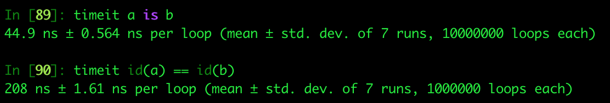
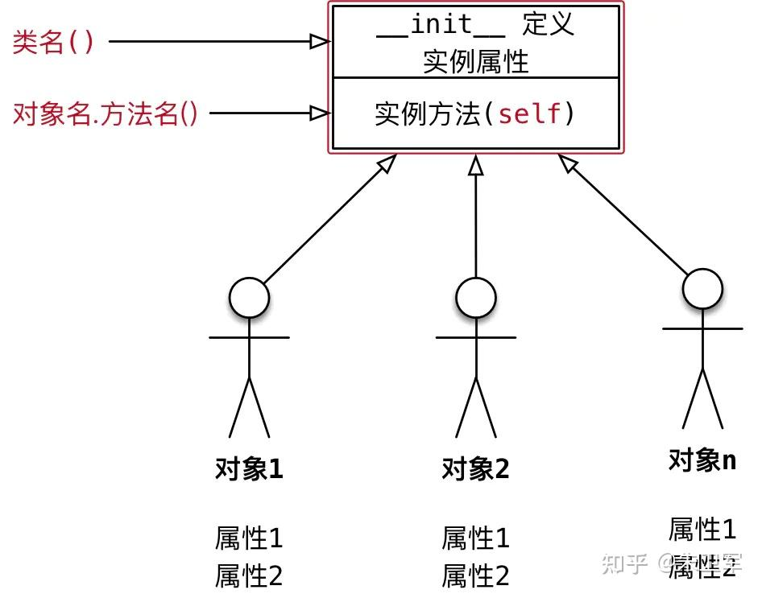

# python 基础


## 字典(Dictionary)

字典是另一种可变容器模型，且可存储任意类型对象。

字典的每个键值 **key:value** 对用冒号 **:** 分割，每个键值对之间用逗号 **,** 分割，整个字典包括在花括号 **{}** 中 ,格式如下所示：

```py
d = {key1 : value1, key2 : value2 }
```

注意：**dict** 作为 Python 的关键字和内置函数，变量名不建议命名为 dict。

键一般是唯一的，如果重复最后的一个键值对会替换前面的，值不需要唯一。

```python
\>>> tinydict = {'a': 1, 'b': 2, 'b': '3'}
\>>> tinydict['b']
'3'
\>>> tinydict
{'a': 1, 'b': '3'}
```

值可以取任何数据类型，但键必须是不可变的，如字符串，数字或元组。

一个简单的字典实例：

```
tinydict = {'Alice': '2341', 'Beth': '9102', 'Cecil': '3258'}
```

也可如此创建字典：

```
tinydict1 = { 'abc': 456 } tinydict2 = { 'abc': 123, 98.6: 37 }
```


### 访问字典里的值

把相应的键放入熟悉的方括弧，如下实例:

```python
#!/usr/bin/python
 
tinydict = {'Name': 'Zara', 'Age': 7, 'Class': 'First'}
 
print "tinydict['Name']: ", tinydict['Name']
print "tinydict['Age']: ", tinydict['Age']
```

以上实例输出结果：

```python
tinydict['Name']:  Zara
tinydict['Age']:  7
```


### 字典内置函数&方法

Python字典包含了以下内置方法：

| 序号 | 函数及描述                                                   |
| :--- | :----------------------------------------------------------- |
| 1    | [dict.clear()](https://www.runoob.com/python/att-dictionary-clear.html) 删除字典内所有元素 |
| 2    | [dict.copy()](https://www.runoob.com/python/att-dictionary-copy.html) 返回一个字典的浅复制 |
| 3    | [dict.fromkeys(seq[, val\])](https://www.runoob.com/python/att-dictionary-fromkeys.html) 创建一个新字典，以序列 seq 中元素做字典的键，val 为字典所有键对应的初始值 |
| 4    | [dict.get(key, default=None)](https://www.runoob.com/python/att-dictionary-get.html) 返回指定键的值，如果值不在字典中返回default值 |


## Python 使用继承创建一个子类

在 Python 中，继承是面向对象编程的一个重要特性。通过继承，子类可以继承父类的属性和方法，并且可以在子类中添加新的属性和方法，或者重写父类的方法。下面是一个简单的例子，展示了如何使用继承创建一个子类。

```python
# 定义一个父类
class Animal:
    def __init__(self, name):
        self.name = name

    def speak(self):
        return f"{self.name} makes a sound."

# 定义一个子类，继承自 Animal
class Dog(Animal):
    def speak(self):
        return f"{self.name} barks."

# 创建父类的实例
animal = Animal("Generic Animal")
print(animal.speak())

# 创建子类的实例
dog = Dog("Buddy")
print(dog.speak())
```

代码解析：

1. `Animal` 是一个父类，它有一个构造函数 `__init__`，用于初始化 `name` 属性。`speak` 方法返回一个字符串，表示动物发出的声音。
2. `Dog` 是一个子类，继承自 `Animal`。它重写了 `speak` 方法，返回一个表示狗叫的字符串。
3. 创建了一个 `Animal` 类的实例 `animal`，并调用 `speak` 方法，输出 "Generic Animal makes a sound."。
4. 创建了一个 `Dog` 类的实例 `dog`，并调用 `speak` 方法，输出 "Buddy barks."。

输出结果：

```python
Generic Animal makes a sound.
Buddy barks.
```


## 字符串

### Python endswith()方法

#### 描述

Python endswith() 方法用于判断字符串是否以指定后缀结尾，如果以指定后缀结尾返回True，否则返回False。可选参数"start"与"end"为检索字符串的开始与结束位置。

#### 语法

endswith()方法语法：

```python
str.endswith(suffix[, start[, end]])
```

#### 参数

- suffix -- 该参数可以是一个字符串或者是一个元素。
- start -- 字符串中的开始位置。
- end -- 字符中结束位置。

#### 返回值

如果字符串含有指定的后缀返回True，否则返回False。


## f-string

从 Python 3.6 开始，`f-strings` 是一种很好的格式化字符串的新方法。它们不仅比其他格式化方式更易读、更简洁、更不容易出错，而且速度也更快！

### f-Strings

**一种在 Python 中格式化字符串的新方法和改进方法**

**f-string亦称为格式化字符串常量（\*formatted string literals\*）**

是Python3.6引入的一种字符串格式化方法，主要目的是使格式化字符串的操作更加简便。

f-string在功能方面不逊于传统的 %-formatting 语句和 str.format() 函数

同时性能又优于二者，且使用起来也更加简洁明了，因此对于Python3.6及以后的版本，推荐使用f-string进行字符串格式化。

#### 简单语法

语法类似于使用 str.format() 的语法，但不那么冗长。

```python
>>> name = "Eric"
>>> age = 74
>>> f"Hello, {name}. You are {age}."
'Hello, Eric. You are 74.'
```

使用大写字母 F 也是有效的：

```python
>>> F"Hello, {name}. You are {age}."
'Hello, Eric. You are 74.'
```


## Python 关键字

### is 关键字

- **is**表示的是[对象标识符](https://zhida.zhihu.com/search?content_id=105928884&content_type=Article&match_order=1&q=对象标识符&zhida_source=entity)，用来检查对象的标识符是否一致，即两个对象在内存中的地址是否一致。在使用`a is b`的时候，相当于`id(a)==id(b)`。
- **==**表示两个对象是否相等，相当于调用`__eq__()`方法，即'a==b' ==>`a.__eq__(b)`。

**None在Python里是个[单例对象](https://zhida.zhihu.com/search?content_id=105928884&content_type=Article&match_order=1&q=单例对象&zhida_source=entity)，一个变量如果是None，它一定和None指向同一个内存地址**。None是python中的一个特殊的常量，表示一个空的对象，空值是python中的一个特殊值。**数据为空并不代表是空对象**，例如[],''等都不是None。None和任何对象比较返回值都是False，除了自己。

```python3
a = None
b = None
print(id(a) == id(b)) # True
```

is None是判断两个对象在内存中的地址是否一致，== None背后调用的**__\*eq__()\***，而**__\*eq__()\*可以被重载**，万一被重载，会造成一定影响，请看下面的例子：

```text
class test():
    def __eq__(self, other):
        return True


t = test()
print(t is None) # False
print(t == None) # True
```

另外从[执行效率](https://zhida.zhihu.com/search?content_id=105928884&content_type=Article&match_order=1&q=执行效率&zhida_source=entity)上来看，'is' *is a LOT faster than '*=='。



> 比较操作符'is'效率优于'=='，因为'is'操作符无法被重载，执行'is'操作只是简单的获取对象的 ID，并进行比较；
> 而'=='操作符则会[递归](https://zhida.zhihu.com/search?content_id=105928884&content_type=Article&match_order=1&q=递归&zhida_source=entity)地遍历对象的所有值，并逐一比较。

## 注释

在 Python3 中，注释不会影响程序的执行，但是会使代码更易于阅读和理解。

Python 中的注释有**单行注释**和**多行注释**。

Python 中单行注释以 # 开头，例如：

```python
# 这是一个注释
print("Hello, World!")
```

### 多行注释

在 Python中，多行字符串（由三个单引号 **'''** 或三个双引号 **"""** 包围的文本块）在某些情况下可以被视为一种实现多行注释的技巧。

**多行注释用三个单引号 \**'''\** 或者三个双引号 \**"""\** 将注释括起来**，例如:

### 单引号（'''）

```python
'''
这是多行注释，用三个单引号
这是多行注释，用三个单引号 
这是多行注释，用三个单引号
'''
print("Hello, World!")
```


### 双引号（"""）

```python
"""
这是多行注释（字符串），用三个双引号
这是多行注释（字符串），用三个双引号 
这是多行注释（字符串），用三个双引号
"""
print("Hello, World!")
```

> **注意**：虽然多行字符串在这里被当作多行注释使用，但它实际上是一个字符串，我们只要不使用它，它不会影响程序的运行。
>
> 这些字符串在代码中可以被放置在一些位置，而不引起实际的执行，从而达到注释的效果。

## Python函数注释

在 Python 中，函数注释（Docstring 和 类型注解）有助于提高代码的可读性和可维护性。下面介绍 Python 函数注释的几种方式：

在 Python 中，函数注释（Docstring 和 类型注解）有助于提高代码的可读性和可维护性。下面介绍 Python 函数注释的几种方式：

### 1. 类型注解（Type Hints）

Python 3 提供了 **类型注解** 来指明函数参数和返回值的类型：

```python
def add(a: int, b: int) -> int:
    return a + b
```

#### 1.1 说明

- `a: int` 和 `b: int` 表示参数 `a` 和 `b` 需要是整数
- `-> int` 表示返回值类型是 `int`

Python **不会强制类型检查**，但可以借助工具（如 `mypy`）进行静态检查：

```python
mypy script.py  # 检查类型
```

### 2. Docstring（文档字符串）

Docstring 用于提供详细的函数说明，通常使用三重引号 `""" """` 或 `''' '''`：

```python
def add(a: int, b: int) -> int:
    """
    计算两个整数的和。

    参数:
    - a (int): 第一个整数
    - b (int): 第二个整数

    返回:
    - int: 两个整数的和

    示例:
    >>> add(3, 5)
    8
    """
    return a + b
```

#### 2.1 说明

- 说明 **函数用途**
- 列出 **参数及类型**
- 指明 **返回值**
- 给出 **示例**

### 3. 不同风格的 Docstring

Python 没有强制使用某种格式，但以下几种风格常见：

#### 3.1 Google 风格

```
def add(a: int, b: int) -> int:
    """
    计算两个整数的和。

    Args:
        a (int): 第一个整数
        b (int): 第二个整数

    Returns:
        int: 两个整数的和

    Example:
        >>> add(3, 5)
        8
    """
    return a + b
```

#### 3.2 NumPy 风格

```
def add(a: int, b: int) -> int:
    """
    计算两个整数的和。

    Parameters
    ----------
    a : int
        第一个整数
    b : int
        第二个整数

    Returns
    -------
    int
        两个整数的和

    Examples
    --------
    >>> add(3, 5)
    8
    """
    return a + b
```

#### 3.3 reStructuredText (Sphinx) 风格

```
def add(a: int, b: int) -> int:
    """
    计算两个整数的和。

    :param a: 第一个整数
    :type a: int
    :param b: 第二个整数
    :type b: int
    :return: 两个整数的和
    :rtype: int

    :example:
        >>> add(3, 5)
        8
    """
    return a + b
```

### 4. 使用 `help()` 查看注释

在 Python 交互式环境或脚本中，可以用 `help()` 查看函数的 Docstring：

```
help(add)
```

输出：

```
Help on function add in module __main__:

add(a: int, b: int) -> int
    计算两个整数的和。

    参数:
    - a (int): 第一个整数
    - b (int): 第二个整数

    返回:
    - int: 两个整数的和
```


### 5. 结合 `typing` 进行更复杂的注解

Python `typing` 模块提供了更多高级的类型注解：

```
from typing import List, Tuple, Union

def process_data(data: List[Union[int, float]]) -> Tuple[int, float]:
    """
    处理数据列表。

    参数:
    - data (List[Union[int, float]]): 由整数和浮点数组成的列表

    返回:
    - Tuple[int, float]: (整数个数, 浮点数总和)
    """
    int_count = sum(1 for x in data if isinstance(x, int))
    float_sum = sum(x for x in data if isinstance(x, float))
    return int_count, float_sum
```


### 6. 总结

| 方法            | 作用                      |
| :-------------- | :------------------------ |
| **类型注解**    | 指定参数和返回值类型      |
| **Docstring**   | 提供函数的详细描述        |
| **Google 风格** | `Args / Returns` 结构清晰 |
| **NumPy 风格**  | 适用于科学计算            |
| **Sphinx 风格** | 适合自动生成文档          |

**推荐写法：** - **简单函数** 直接用类型注解即可 - **复杂函数** 结合 **Docstring + 类型注解** - **团队开发** 统一使用 **Google/NumPy/Sphinx 风格**


## __init__用法

要想明白__init__，你首先要弄清楚[面向对象](https://zhida.zhihu.com/search?content_id=197276389&content_type=Article&match_order=1&q=面向对象&zhida_source=entity)是什么？

Python是一门面向对象的编程语言，面向对象是一种代码封装的技术，包含了各种功能，让代码能重复利用、高效节能。

我们通过class来定义类，类又包含了属性、方法等，属性是类里面的变量，方法是类里面的函数

而__init__就是其中一种函数，叫做[构造函数](https://www.zhihu.com/search?q=构造函数&search_source=Entity&hybrid_search_source=Entity&hybrid_search_extra={"sourceType"%3A"answer"%2C"sourceId"%3A2390824591})。

```python
def __init__(self,...):
    代码块
```

每次创建类的[实例对象](https://zhida.zhihu.com/search?content_id=197276389&content_type=Article&match_order=1&q=实例对象&zhida_source=entity)时，__init__函数就会自动被调用，无论它里面有什么样的变量、计算，统统会自动调用。

可能你又会问实例对象是什么？其实我们可以把类比作一张建筑图纸，而实例对象是建造的房子，房子的所有功能都是根据图纸来设计的。



理解__init__函数需要搞清楚以下三点：

> 1.带有两个下划线开头的函数是声明该属性为私有,不能在类地外部被使用或直接访问。
> 2.init函数（方法）支持带参数的类的初始化 ，也可为声明该类的属性
> 3.init函数（方法）的第一个参数必须是 self（self为习惯用法，也可以用别的名字），后续参数则可 以自由指定，和定义函数没有任何区别。

```python
# 不带参数
class Sample:
    def __init__(self):
        print("自动调用构造方法")
        # 定义了一个实例属性
        self.name = "小明"


test = Sample()
print(test.name)

# 输出结果
自动调用构造方法
小明
```

如上，在创建 test这个对象时，隐式调用了手动创建的__init__()构造方法

构造函数__init__为什么会存在？

顾名思义，就像房子必须有地基、框架、大梁一样，是房子的基础，实例对象也需要有的构造的基础，这就是构造函数的作用，给实例对象最原始的属性。

所以综上，**构造方法__init__用于创建实例对象时使用，每当创建一个类的实例对象时，Python** **[解释器](https://www.zhihu.com/search?q=解释器&search_source=Entity&hybrid_search_source=Entity&hybrid_search_extra={"sourceType"%3A"answer"%2C"sourceId"%3A2390824591})都会自动调用它，用来初始化对象的某些属性。**


# IO 编程

## 文件读写

读写文件是最常见的IO操作。Python内置了读写文件的函数，用法和C是兼容的。

读写文件前，我们先必须了解一下，在磁盘上读写文件的功能都是由操作系统提供的，现代操作系统不允许普通的程序直接操作磁盘，所以，读写文件就是请求操作系统打开一个文件对象（通常称为文件描述符），然后，通过操作系统提供的接口从这个文件对象中读取数据（读文件），或者把数据写入这个文件对象（写文件）。

### 读文件

要以读文件的模式打开一个文件对象，使用Python内置的`open()`函数，传入文件名和标示符：

```plain
>>> f = open('/Users/michael/test.txt', 'r')
```

标示符`'r'`表示读，这样，我们就成功地打开了一个文件。

如果文件不存在，`open()`函数就会抛出一个`IOError`的错误，并且给出错误码和详细的信息告诉你文件不存在：

```plain
>>> f=open('/Users/michael/notfound.txt', 'r')
Traceback (most recent call last):
  File "<stdin>", line 1, in <module>
FileNotFoundError: [Errno 2] No such file or directory: '/Users/michael/notfound.txt'
```

如果文件打开成功，接下来，调用`read()`方法可以一次读取文件的全部内容，Python把内容读到内存，用一个`str`对象表示：

```plain
>>> f.read()
'Hello, world!'
```


最后一步是调用`close()`方法关闭文件。文件使用完毕后必须关闭，因为文件对象会占用操作系统的资源，并且操作系统同一时间能打开的文件数量也是有限的：

```plain
>>> f.close()
```


由于文件读写时都有可能产生`IOError`，一旦出错，后面的`f.close()`就不会调用。所以，为了保证无论是否出错都能正确地关闭文件，我们可以使用`try ... finally`来实现：

```python
try:
    f = open('/path/to/file', 'r')
    print(f.read())
finally:
    if f:
        f.close()
```


但是每次都这么写实在太繁琐，所以，Python引入了`with`语句来自动帮我们调用`close()`方法：

```python
with open('/path/to/file', 'r') as f:
    print(f.read())
```


这和前面的`try ... finally`是一样的，但是代码更佳简洁，并且不必调用`f.close()`方法。

调用`read()`会一次性读取文件的全部内容，如果文件有10G，内存就爆了，所以，要保险起见，可以反复调用`read(size)`方法，每次最多读取size个字节的内容。另外，调用`readline()`可以每次读取一行内容，调用`readlines()`一次读取所有内容并按行返回`list`。因此，要根据需要决定怎么调用。

如果文件很小，`read()`一次性读取最方便；如果不能确定文件大小，反复调用`read(size)`比较保险；如果是配置文件，调用`readlines()`最方便：

```python
for line in f.readlines():
    print(line.strip()) # 把末尾的'\n'删掉
```


### file-like Object

像`open()`函数返回的这种有个`read()`方法的对象，在Python中统称为file-like Object。除了file外，还可以是内存的字节流，网络流，自定义流等等。file-like Object不要求从特定类继承，只要写个`read()`方法就行。

`StringIO`就是在内存中创建的file-like Object，常用作临时缓冲。

### 二进制文件

前面讲的默认都是读取文本文件，并且是UTF-8编码的文本文件。要读取二进制文件，比如图片、视频等等，用`'rb'`模式打开文件即可：

```plain
>>> f = open('/Users/michael/test.jpg', 'rb')
>>> f.read()
b'\xff\xd8\xff\xe1\x00\x18Exif\x00\x00...' # 十六进制表示的字节
```


### 字符编码

要读取非UTF-8编码的文本文件，需要给`open()`函数传入`encoding`参数，例如，读取GBK编码的文件：

```plain
>>> f = open('/Users/michael/gbk.txt', 'r', encoding='gbk')
>>> f.read()
'测试'
```


遇到有些编码不规范的文件，你可能会遇到`UnicodeDecodeError`，因为在文本文件中可能夹杂了一些非法编码的字符。遇到这种情况，`open()`函数还接收一个`errors`参数，表示如果遇到编码错误后如何处理。最简单的方式是直接忽略：

```plain
>>> f = open('/Users/michael/gbk.txt', 'r', encoding='gbk', errors='ignore')
```


### 写文件

写文件和读文件是一样的，唯一区别是调用`open()`函数时，传入标识符`'w'`或者`'wb'`表示写文本文件或写二进制文件：

```plain
>>> f = open('/Users/michael/test.txt', 'w')
>>> f.write('Hello, world!')
>>> f.close()
```


你可以反复调用`write()`来写入文件，但是务必要调用`f.close()`来关闭文件。当我们写文件时，操作系统往往不会立刻把数据写入磁盘，而是放到内存缓存起来，空闲的时候再慢慢写入。只有调用`close()`方法时，操作系统才保证把没有写入的数据全部写入磁盘。忘记调用`close()`的后果是数据可能只写了一部分到磁盘，剩下的丢失了。所以，还是用`with`语句来得保险：

```python
with open('/Users/michael/test.txt', 'w') as f:
    f.write('Hello, world!')
```


要写入特定编码的文本文件，请给`open()`函数传入`encoding`参数，将字符串自动转换成指定编码。

细心的童鞋会发现，以`'w'`模式写入文件时，如果文件已存在，会直接覆盖（相当于删掉后新写入一个文件）。如果我们希望追加到文件末尾怎么办？可以传入`'a'`以追加（append）模式写入。

所有模式的定义及含义可以参考Python的[官方文档](https://docs.python.org/3/library/functions.html#open)。

### 练习

请将本地一个文本文件读为一个str并打印出来：

```python
fpath = '/etc/timezone'

with open(fpath, 'r') as f:
    s = f.read()
    print(s)

# 运行代码观察结果
```

### 小结

在Python中，文件读写是通过`open()`函数打开的文件对象完成的。使用`with`语句操作文件IO是个好习惯。


# 包管理

## pip 安装

```
C:\Windows\system32> C:\ProgramData\anaconda3\python.exe -m pip install --upgrade pip
```

这个命令是用于升级 pip 包管理器的。让我详细解释每个部分：
命令解析

- C:\ProgramData\anaconda3\python.exe - 指定使用 Anaconda 安装的 Python 解释器
- -m pip - 运行 pip 模块作为脚本
- install --upgrade pip - 安装并升级 pip 包到最新版本

为什么要用这种方式

1. 避免路径冲突：当系统中有多个 Python 安装时，确保使用正确的 pip
2. 权限问题：Anaconda 通常安装在系统目录中，需要明确指定路径
3. 环境一致性：确保 pip 和 Python 版本匹配


## 镜像源

问题原因
这是由于网络连接问题导致无法访问 PyPI 官方仓库，常见于某些网络环境下。

解决方案
**方法一：使用国内镜像源（推荐）**
根据你 README.md 中提供的地址，使用清华大学镜像源：

```py
pip3 install django==2.0.1 -i https://pypi.tuna.tsinghua.edu.cn/simple
```

或者配置默认镜像源：

```
pip3 config set global.index-url https://pypi.tuna.tsinghua.edu.cn/simple
```

配置完成后，正常安装：

**方法二：临时跳过 SSL 验证（不推荐）**

```
pip3 install django==2.0.1 --trusted-host pypi.org --trusted-host pypi.python.org --trusted-host files.pythonhosted.org
```


然后可以通过以下命令安装所有依赖：

```
pip3 install -r requirements.txt
```

使用命令行参数指定镜像源

```
pip install -r requirements.txt -i https://pypi.tuna.tsinghua.edu.cn/simple
```


# 跨域

```
pip install django-cors-headers
```

```python
# Application definition
INSTALLED_APPS = [
    'corsheaders',
]

MIDDLEWARE = [
    'corsheaders.middleware.CorsMiddleware',
]

# CORS 配置
CORS_ALLOW_ALL_ORIGINS = True
```


# Python 内置函数

## isinstance() 

### 描述

isinstance() 函数来判断一个对象是否是一个已知的类型，类似 type()。

> isinstance() 与 type() 区别：
>
> - type() 不会认为子类是一种父类类型，不考虑继承关系。
> - isinstance() 会认为子类是一种父类类型，考虑继承关系。
>
> 如果要判断两个类型是否相同推荐使用 isinstance()。

### 语法

以下是 isinstance() 方法的语法:

```
isinstance(object, classinfo)
```

#### 参数

- object -- 实例对象。
- classinfo -- 可以是直接或间接类名、基本类型或者由它们组成的元组。

### 返回值

如果对象的类型与参数二的类型（classinfo）相同则返回 True，否则返回 False。。

------

### 实例

以下展示了使用 isinstance 函数的实例：

```
>>>a = 2
>>> isinstance (a,int)
True
>>> isinstance (a,str)
False
>>> isinstance (a,(str,int,list))    # 是元组中的一个返回 True
True
```

type() 与 isinstance()区别：

```python
class A:
    pass
 
class B(A):
    pass
 
isinstance(A(), A)    # returns True
type(A()) == A        # returns True
isinstance(B(), A)    # returns True
type(B()) == A        # returns False
```


# 理解布尔值与假值元素

### 什么元素为假？

在Python中，以下元素被视为假（False）值：

1. `False`：布尔值False本身是假值。
2. `None`：None表示空值或缺失值，也是假值。
3. `0`：整数0被视为假值。
4. `0.0`：浮点数0.0同样被视为假值。
5. `""`：空字符串也是假值。
6. `[]`：空列表是假值。
7. `()`：空元组是假值。
8. `{}`：空字典是假值。
9. `set()`：空集合也被视为假值。

### 具体实例分析

让我们通过一些具体示例来了解这些假值元素的应用：

#### 示例 1: 条件语句

```python3
value = 0if not value:
    print("value 是假值")
else:
    print("value 是真值")
```

在这个示例中，value 的值为0，它被视为假值，因此条件成立，会输出"value 是假值"。

#### 示例 2: 函数返回值

```python3
def is_empty(input_string):    if not input_string:
        return True
    else:
        return False
```

这个函数用于检查输入字符串是否为空，如果输入字符串是空字符串，它将返回True，否则返回False。

#### 示例 3: 列表判空

```python3
my_list = []if not my_list:
    print("my_list 是空列表")
else:
    print("my_list 不是空列表")
```

这个示例检查列表my_list是否为空，如果是空列表，它被视为假值，会输出"my_list 是空列表"。

了解Python中的真与假概念对于编写条件语句、处理数据和执行逻辑操作非常重要。通过识别和利用假值元素，你可以更好地控制程序的流程，使代码更加清晰和高效。


# 类与对象

## 类的理解与使用

### 通俗理解类

类（英文名 class），是具有相同特性（属性）和行为（方法）的对象（实例）的抽象模板。

从定义上来理解类，是一件非常吃力的事情，特别是对那些没有任何基础的初学者。

下面我举例来说明类中一些关键术语都是什么意思：

- 类：动物属于一个类，植物属于一个类
- 实例：猫和狗都属于同一类，就是动物类，那么猫和狗是动物类的实例/对象。
- 属性：类中所有的变量，都叫做属性。
- 方法：类中的所有函数，都叫做方法。

类与对象的关系就如模具和铸件的关系，类的实例化的结果就是对象，而对象的抽象就是类，类描述了一组有相同特性（属性）和相同行为（方法）的对象。

### 如何定义类

定义一个类，使用的是 class 关键字

下边我定义了一个 Animal 的类

```python
class Animal:
    age = 0
    def __init__(self, name):
        self.name = name

    def run(self):
        print(f"{self.name} 跑起来了")
```

其中

- `Animal` 是类名
- `__init__` 是构造函数，用于实例的初始化
- `self.name` 是实例属性，`age` 是类属性
- `run` 是方法，第一个参数 self 是什么意思呢？这个咱后面再讲。

除了上面这种写法外

```python
# 第一种写法
class Animal:
  ...
```

还有另外两种写法，与之是等价的

```python
# 第二种写法
class Animal():
  ...

# 第二种写法
class Animal(object):
  ...
```

因为在 Python 3 中，无论你是否显示继承自 object，Python 解释器都会默认你继承 object ，这是新式类的写法，与之对应的是 Python 2 的经典类写法（Python 2 已经远去，无需要再了解经典类写法）。


### 如何实例化

定义了类之后，就可以通过下边的写法实例化它，并访问属性，调用方法

```
>>> class Animal:
...     def __init__(self, name):
...         self.name = name
...     def run(self):
...         print(f"{self.name} 跑起来了")
...
>>>
>>> dog=Animal(name="小黑")  # 实例化出 dog 对象
```

在实例化时传入的参数 `name="小黑"` 传进入到构造函数 `__init__` 中，最终赋值 `self.name` 成为实例的属性。

### 方法的调用

实例化成对象后，如果访问实例属性，可以用 `对象.属性名` 进行访问。

```python
>>> dog=Animal(name="小黑")
>>> dog.name  # 访问属性
'小黑'
```

如果要调用方法，有两种方法

1. 通过 `对象.方法名`：使用这种方法，在定义方法时 self 就代表对象（dog），调用时无需再传入了。

```python
>>> dog=Animal(name="小黑")
>>> dog.run()  # 调用方法
小黑 跑起来了
```

1. 通过 `类.方法名`：使用这种方法，self 参数要传入实例对象

```python
>>> dog=Animal(name="小黑")
>>> Animal.run(dog)
小黑 跑起来了
```


